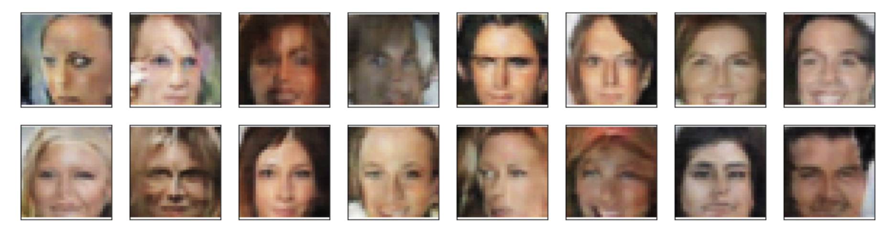

# FaceGeneration

Face Generation from Celebrities Photos Using Generative Adversarial Networks (Udacity Deep Learning Nanodegree)

# Objective

The objective of this project is to generate new faces that look as realistic as possible by training a GAN with data from the CelebFaces Attributes Dataset (CelebA)

# Model

The Discriminator and Generator had the following convolutional and fully connected linear layers

### Model - Discriminator

| Layer | Input Dimension | Output Dimension | Batch Normalization |
| ----- | --------------- | ---------------- | ------------------- |
| Conv1 | 3               | 32               | False               |
| Conv2 | 32              | 64               | True                |
| Conv3 | 64              | 128              | True                |
| FC    | 2048            | 1                | False               |

### Model - Generator

| Layer   | Input Dimension | Output Dimension | Batch Normalization |
| ------- | --------------- | ---------------- | ------------------- |
| FC      | 100             | 2048             | False               |
| Deconv1 | 128             | 64               | True                |
| Deconv2 | 64              | 32               | True                |
| Deconv3 | 32              | 3                | True                |

# Results

The result of the trained model looks like this

